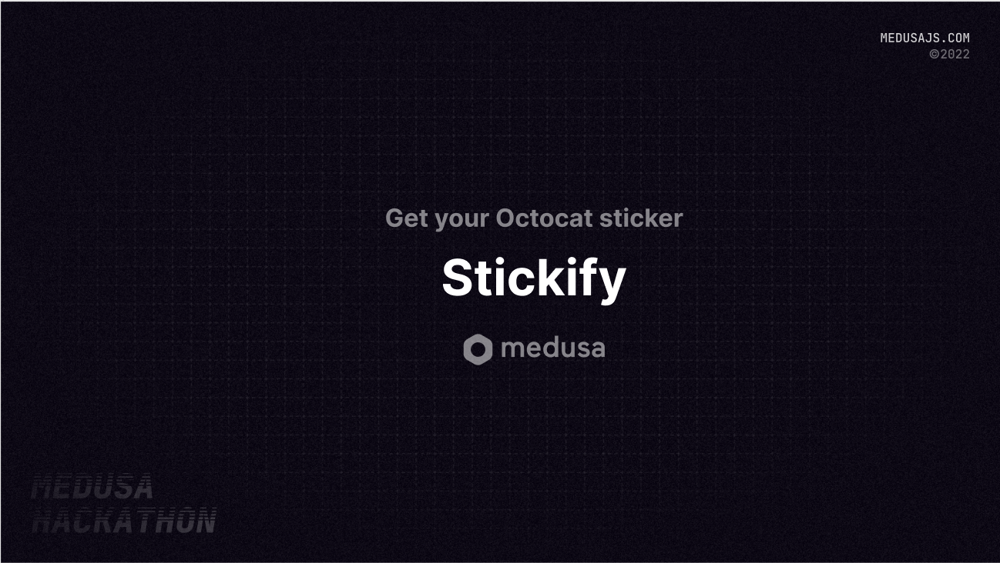
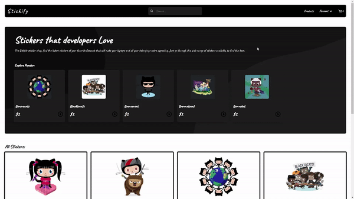

# Stickify - For Octocat Lovers


## About
This is an ecommerce site which sells the octocat stickers. Users can find their favourite sticker and buy it from our store

### Preview


### Description

The project is built on top of Medusa.js. Making it a headless ecommerce web application. 
Some of the features available in the application are:
- Search Products, search as you type
- Checkout
- Login / Logout
- Add items to your cart and review it before making a checkout

## Set up Project

### Prerequisites

Make sure you have node.js installed in your machine on your machine.

### Install packages

```
npm i
```

### Start the project


```
npm run start
```


Make sure the medure store is running on the port: 9000 with CORS enabled for port 7000 (Stickify store)

## Resources

- [Medusa’s GitHub repository](https://github.com/medusajs/medusa)
- [Dillinger.io/](https://dillinger.io/)
